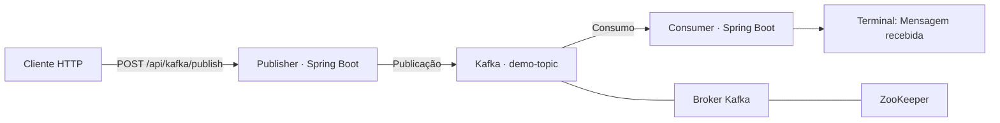

# Kafka Demo

Projeto de demonstração de mensageria com **Java 21**, **Spring Boot** e **Apache Kafka**. Uma aplicação publica mensagens recebidas por HTTP, e outra consome essas mensagens e as exibe no terminal.

## Arquitetura



- **Publisher:** expõe um endpoint REST e usa `KafkaTemplate<String, String>` para publicar no tópico configurado.
- **Consumer:** usa `@KafkaListener` para receber mensagens e imprime `Mensagem recebida: <mensagem>` com `System.out.println`.
- **Kafka e ZooKeeper:** executam em contêineres definidos no Docker Compose.

As aplicações Java são executadas separadamente na máquina local. O Compose contém somente a infraestrutura de mensageria.

## Tecnologias e versões

Versões declaradas nos arquivos do projeto:

| Componente | Versão/configuração |
| --- | --- |
| Java | 21 |
| Spring Boot | 4.1.1 |
| Maven via Wrapper | 3.9.16 |
| Imagem Kafka | `confluentinc/cp-kafka:7.8.11` |
| Imagem ZooKeeper | `confluentinc/cp-zookeeper:7.8.11` |

O publisher utiliza os starters Kafka e Web MVC. O consumer utiliza o starter Kafka e declara a dependência Jackson Databind.

## Estrutura

```text
kafka-demo/
├── docker-compose.yml
├── consumer/
│   ├── pom.xml
│   ├── mvnw / mvnw.cmd
│   └── src/
│       ├── main/
│       │   ├── java/io/huser0/consumer/
│       │   │   ├── ConsumerApplication.java
│       │   │   └── service/KafkaConsumerService.java
│       │   └── resources/application.yaml
│       └── test/java/io/huser0/consumer/ConsumerApplicationTests.java
└── publisher/
    ├── pom.xml
    ├── mvnw / mvnw.cmd
    └── src/
        ├── main/
        │   ├── java/io/huser0/publisher/
        │   │   ├── PublisherApplication.java
        │   │   ├── controller/KafkaProducerController.java
        │   │   └── service/KafkaProducerService.java
        │   └── resources/application.yaml
        └── test/java/io/huser0/publisher/PublisherApplicationTests.java
```

Cada aplicação é um projeto Maven independente, com seu próprio `pom.xml` e Maven Wrapper.

## Pré-requisitos

- JDK 21 instalado, com `JAVA_HOME` configurado.
- Docker em execução, com suporte a contêineres Linux e Docker Compose (`docker compose`).
- Git para clonar o repositório.
- Acesso à internet para baixar as imagens, o Maven e as dependências na primeira execução.
- Portas locais `9092` (Kafka) e `8080` (publisher) disponíveis.

Não é necessário instalar o Maven separadamente: os comandos abaixo utilizam o Wrapper incluído em cada aplicação.

## Execução local

### 1. Clonar o repositório

```sh
git clone https://github.com/huser0/kafka-demo.git
cd kafka-demo
```

### 2. Iniciar Kafka e ZooKeeper

Na raiz do repositório:

```sh
docker compose up -d
docker compose ps
docker compose logs -f kafka
```

Aguarde a inicialização do broker. Use `Ctrl+C` para sair do acompanhamento dos logs; os contêineres continuam em execução.

O broker fica acessível às aplicações locais em `localhost:9092`. O ZooKeeper é acessado pelo Kafka em `zookeeper:2181`, dentro da rede do Compose, sem porta publicada para a máquina local.

### 3. Preparar o tópico

O código usa `demo-topic`, mas não contém uma declaração `NewTopic` nem um serviço de inicialização de tópicos no Compose. Para criar o tópico explicitamente, execute na raiz:

```sh
docker compose exec kafka kafka-topics --bootstrap-server localhost:9092 --create --if-not-exists --topic demo-topic --partitions 1 --replication-factor 1
```

Uma partição e fator de replicação 1 são escolhas para esta execução local; o projeto não define esses valores para `demo-topic`.

Para consultar o tópico:

```sh
docker compose exec kafka kafka-topics --bootstrap-server localhost:9092 --describe --topic demo-topic
```

### 4. Iniciar o consumer

Abra um terminal na raiz do repositório.

**Linux/macOS:**

```sh
cd consumer
sh mvnw spring-boot:run
```

**Windows — PowerShell:**

```powershell
cd consumer
.\mvnw.cmd spring-boot:run
```

Mantenha o terminal aberto para acompanhar as mensagens recebidas.

### 5. Iniciar o publisher

Abra outro terminal na raiz do repositório.

**Linux/macOS:**

```sh
cd publisher
sh mvnw spring-boot:run
```

**Windows — PowerShell:**

```powershell
cd publisher
.\mvnw.cmd spring-boot:run
```

Os exemplos usam `http://localhost:8080`, a porta padrão do Spring Boot para a aplicação web. O projeto não declara `server.port`.

## Publicar uma mensagem

### Endpoint

```http
POST /api/kafka/publish?message=Ola%20Kafka
```

| Parâmetro | Local | Tipo | Obrigatório |
| --- | --- | --- | --- |
| `message` | Parâmetro de requisição (`@RequestParam`) | String | Sim |

O endpoint recebe `message` como parâmetro de consulta ou formulário. Não há um corpo JSON definido pelo controller.

### Exemplo com curl

```sh
curl -X POST "http://localhost:8080/api/kafka/publish" --data-urlencode "message=Ola Kafka"
```

No PowerShell, use `curl.exe` para executar o mesmo exemplo com curl, ou utilize:

```powershell
Invoke-RestMethod -Method Post -Uri "http://localhost:8080/api/kafka/publish" -ContentType "application/x-www-form-urlencoded" -Body @{ message = "Ola Kafka" }
```

Quando o método do controller retorna normalmente, a resposta definida no código é **HTTP 200**, com o texto:

```text
Enviada...: Ola Kafka
```

O publisher imprime:

```text
Mensagem enviada: Ola Kafka
```

Após o recebimento pelo consumer, seu terminal deve mostrar:

```text
Mensagem recebida: Ola Kafka
```

**O envio é assíncrono.** O serviço chama `KafkaTemplate.send(...)`, mas não aguarda nem trata seu resultado. A resposta HTTP e a mensagem impressa pelo publisher não confirmam que o broker recebeu o registro ou que o consumer o processou. Confira o terminal do consumer para verificar o fluxo completo.

## Configurações

As configurações das aplicações estão em [publisher/src/main/resources/application.yaml](publisher/src/main/resources/application.yaml) e [consumer/src/main/resources/application.yaml](consumer/src/main/resources/application.yaml).

| Propriedade | Aplicação | Valor |
| --- | --- | --- |
| `spring.application.name` | Publisher / Consumer | `publisher` / `consumer` |
| `spring.kafka.bootstrap-servers` | Ambas | `localhost:9092` |
| `app.topic.name` | Ambas | `demo-topic` |
| `spring.kafka.consumer.group-id` | Consumer | `demo-consumer-group` |
| `spring.kafka.consumer.auto-offset-reset` | Consumer | `earliest` |
| `spring.kafka.consumer.enable-auto-commit` | Consumer | `true` |

O publisher usa `StringSerializer` para chaves e `JacksonJsonSerializer` para valores. O consumer usa `StringDeserializer` para chaves e `JacksonJsonDeserializer` para valores. Embora os métodos Java trabalhem com `String`, o valor da mensagem é serializado em JSON no Kafka. O serviço de publicação não fornece uma chave ao enviar a mensagem.

`earliest` orienta a leitura a partir do início disponível quando o grupo não possui um offset válido; reiniciar o consumer com o mesmo grupo não implica reler todas as mensagens já consumidas.

Para mudar o tópico, ajuste `app.topic.name` nas duas aplicações e prepare o novo tópico no broker.

No [docker-compose.yml](docker-compose.yml), o Kafka anuncia `PLAINTEXT://localhost:9092`. Essa configuração atende à execução das aplicações na máquina local. Para executá-las em outros contêineres ou máquinas, será necessário adequar os listeners anunciados e os endereços de conexão.

## Testes existentes

Cada aplicação contém um teste `contextLoads()` anotado com `@SpringBootTest`. Os testes verificam o carregamento do contexto; não há asserções de publicação HTTP ou consumo de mensagens de ponta a ponta.

Com a infraestrutura iniciada, execute dentro de cada diretório (`consumer` e `publisher`):

**Linux/macOS:**

```sh
sh mvnw test
```

**Windows — PowerShell:**

```powershell
.\mvnw.cmd test
```

## Encerrar

Encerre cada aplicação Java com `Ctrl+C`. Em seguida, na raiz do repositório:

```sh
docker compose down
```

O Compose não declara volumes de dados gerenciados pelo projeto. Não use esta configuração como garantia de persistência das mensagens após remover e recriar os contêineres.

## Escopo da demonstração

O código implementa publicação de uma string por HTTP e consumo com saída no terminal. Não há persistência em banco de dados, interface gráfica, autenticação da API, configuração de TLS/SASL, tratamento próprio de falhas assíncronas ou fila de mensagens não processadas (DLQ).

Este README foi elaborado por leitura do código e das configurações do commit [`c28e6cb`](https://github.com/huser0/kafka-demo/tree/c28e6cbd79e5d8e357b1bf52870385e1b25e78d9). Os comandos e as saídas acima descrevem a execução esperada; não representam uma validação de execução ponta a ponta.
